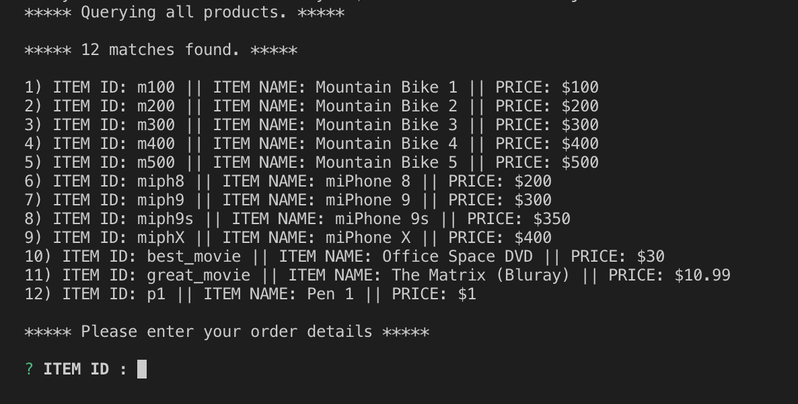
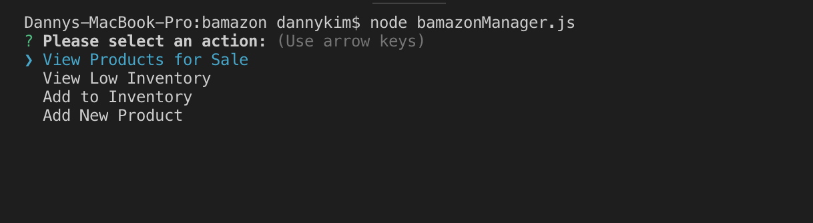
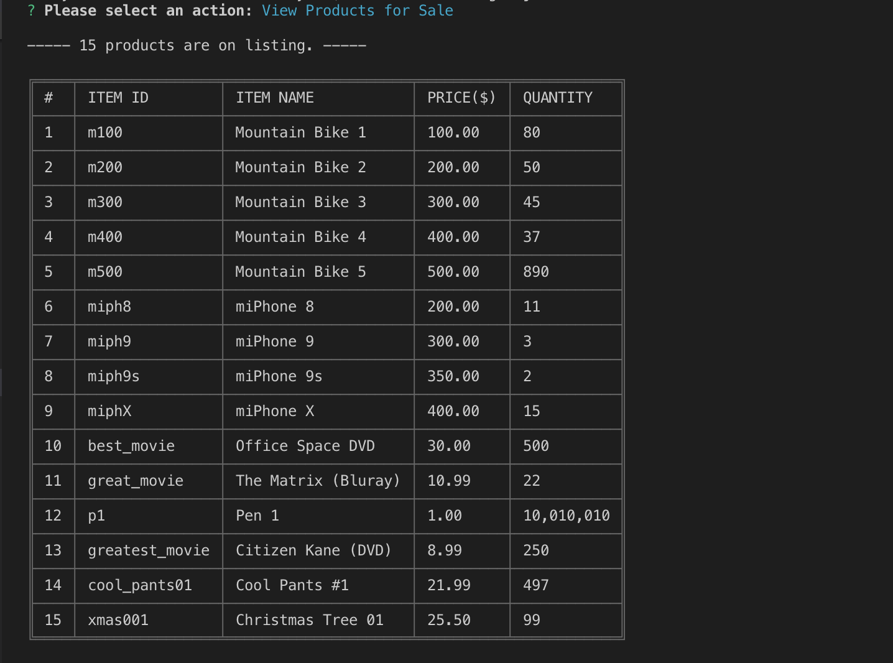
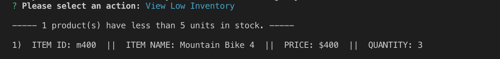
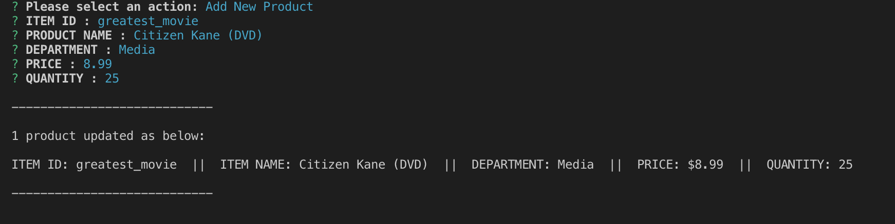

# Bamazon

## Overview

This is a command line application that simulates operations of an eCommerce storefront, built with Node.js, Javascript and MySQL.

What you can do:

- As customer, you can review the catalog and place an order.
- As manager, you can take in orders, review inventory, restock items and introduce new products.
- Track product sales across the store's departments and provide a summary of the highest-grossing departments in the store.

## How to Use

### Customers

1. Run app

```shell
node bamazonCustomer.js
```

2. You will be shown the 'catalog'. Enter the desired item and quantity to place your order.



3. A valid order will be processed, and your 'receipt' will be shown. (If there is insufficient stock, you will be able to adjust your quantity and make a different order.)


### Managers

1. Run

```shell
node bamazonManager.js
```

2. Manager view starts with a list of actions.



3. You may choose to view the full catalog, including the SKU-level stock counts.



4. You can check for low inventory...



5. ...and replenish it by ordering additional stock.


6. Finally, you could introduce new items to your loyal customers!



### Supervisors

1. When a customer makes a purchase, the revenue is added to the database for the Supervisor to track.

   There are eyes everywhere! Here are what those eyes can do:


2. Supervisor can review product sales by department.

   Looks like Electronics department is doing well but Media dept needs to work on their _game_!


3. Supervisor is also able to add a new department.


