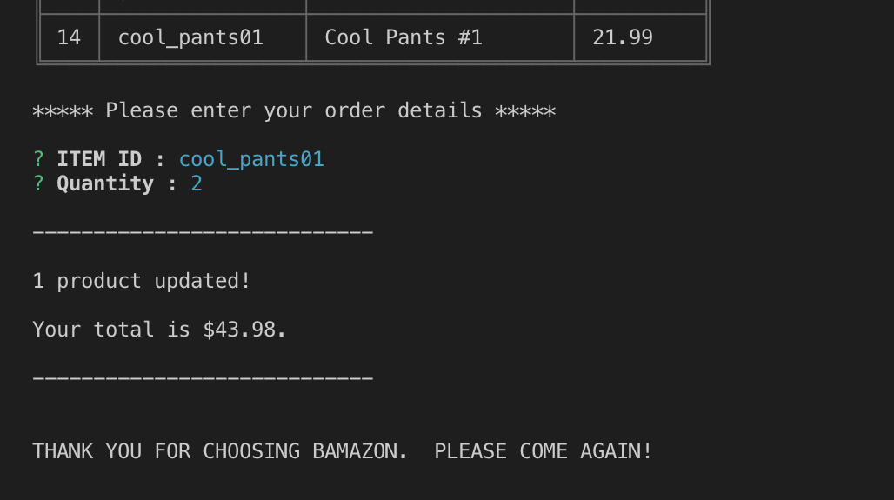
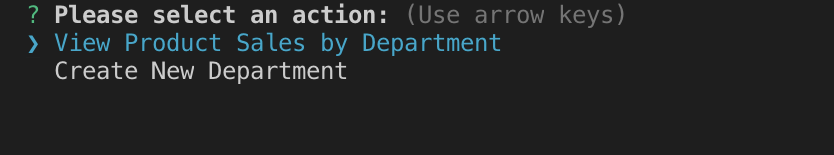
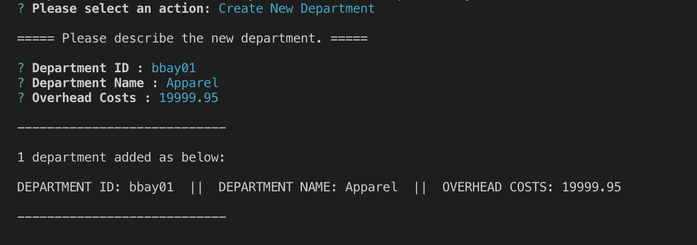

# Bamazon

## Overview

This is a command line application that simulates operations of an eCommerce storefront, built with Node.js, Javascript and MySQL.

What you can do:

- As [**customer**](#customers), review the catalog and place an order.
- As [**manager**](###managers), review inventory, restock items and introduce new products.
- As [**supervisor**](###supervisors), track product sales across the departments and create new departments.

## How to Use

### <a name="customers"></a>Customers

1. Run the customer app.

```shell
node bamazonCustomer.js
```

2. You will be shown the 'catalog'. Enter the desired item and quantity to place your order.


3. A valid order will be processed, and your 'receipt' will be shown. (If there is insufficient stock, you will be able to adjust your quantity and make a different order.)



### Managers

1. Run the manager app.

```shell
node bamazonManager.js
```

2. Manager view starts with a list of actions.


3. You may choose to view the full catalog, including the SKU-level stock counts.


4. You can check for low inventory...


5. ...and replenish it by ordering additional stock.


6. Finally, you could introduce new items to your loyal customers!


### Supervisors

1. Run the supervisor app.

```shell
node bamazonSupervisor.js
```

2. When a customer makes a purchase, the revenue is added to the database for the Supervisor to track.

   There are eyes everywhere! Here are what those eyes can do:



3. Supervisor can review product sales by department.

   Looks like the Electronics department is _electrified_ but the Media department needs to work on their _game_!


4. Supervisor is also able to add a new department.



5. Department listing confirms successful creation of a new business line!


Remember the following law of business:

    (Phase 1) Launch new business
    (Phase 2) ???
    (Phase 3) ___PROFIT___!!!

## Components

- [Node.js](https://nodejs.org/en/)
- [npm: mysql](https://www.npmjs.com/package/mysql)
- [npm: cli-table](https://www.npmjs.com/package/cli-table)
