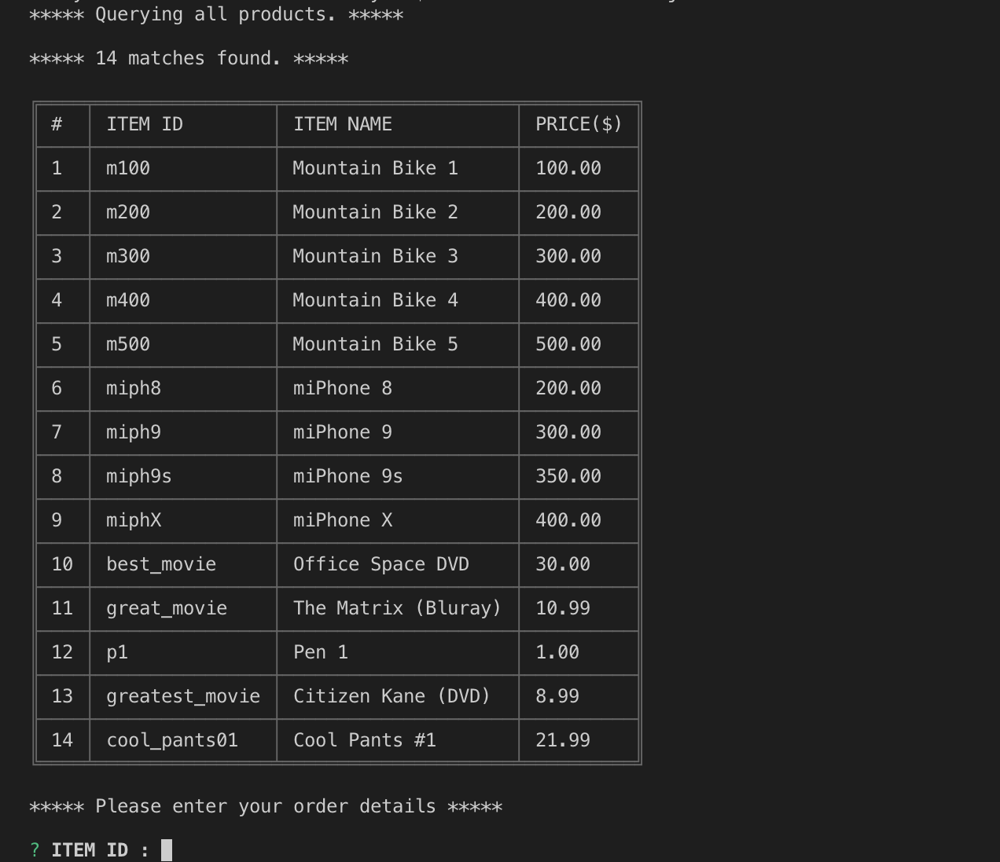
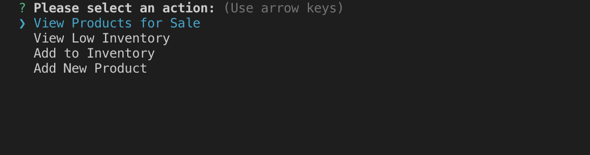
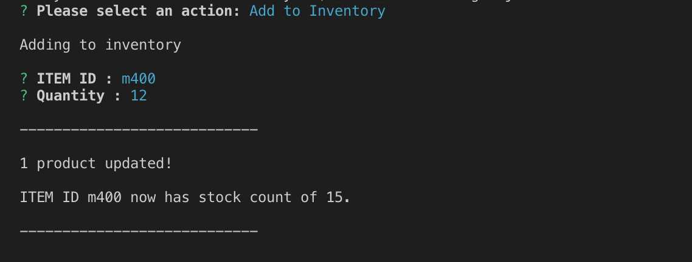

# Bamazon

## Overview

This is a command line application that simulates operations of an eCommerce storefront, built with Node.js, Javascript and MySQL.

What you can do:

- As customer, you can review the catalog and place an order.
- As manager, you can take in orders, review inventory, restock items and introduce new products.
- Track product sales across the store's departments and provide a summary of the highest-grossing departments in the store.

## How to Use

### Customers

1. Run app

```shell
node bamazonCustomer.js
```

2. You will be shown the 'catalog'. Enter the desired item and quantity to place your order.



3. A valid order will be processed, and your 'receipt' will be shown. (If there is insufficient stock, you will be able to adjust your quantity and make a different order.)


### Managers

1. Run

```shell
node bamazonManager.js
```

2. Manager view starts with a list of actions.



3. You may choose to view the full catalog, including the SKU-level stock counts.


4. You can check for low inventory...


5. ...and replenish it by ordering additional stock.



6. Finally, you could introduce new items to your loyal customers!


### Supervisors

1. When a Customer makes a purchase, the revenue is added to the database.

---

### Challenge #3: Supervisor View (Final Level)

1. Create a new MySQL table called `departments`. Your table should include the following columns:

   - department_id

   - department_name

   - over_head_costs (A dummy number you set for each department)

2. Modify the products table so that there's a product_sales column, and modify your `bamazonCustomer.js` app so that when a customer purchases anything from the store, the price of the product multiplied by the quantity purchased is added to the product's product_sales column.

   - Make sure your app still updates the inventory listed in the `products` column.

3. Create another Node app called `bamazonSupervisor.js`. Running this application will list a set of menu options:

   - View Product Sales by Department

   - Create New Department

4. When a supervisor selects `View Product Sales by Department`, the app should display a summarized table in their terminal/bash window. Use the table below as a guide.

| department_id | department_name | over_head_costs | product_sales | total_profit |
| ------------- | --------------- | --------------- | ------------- | ------------ |
| 01            | Electronics     | 10000           | 20000         | 10000        |
| 02            | Clothing        | 60000           | 100000        | 40000        |

5. The `total_profit` column should be calculated on the fly using the difference between `over_head_costs` and `product_sales`. `total_profit` should not be stored in any database. You should use a custom alias.

6. If you can't get the table to display properly after a few hours, then feel free to go back and just add `total_profit` to the `departments` table.

   - Hint: You may need to look into aliases in MySQL.

   - Hint: You may need to look into GROUP BYs.

   - Hint: You may need to look into JOINS.

   - **HINT**: There may be an NPM package that can log the table to the console. What's is it? Good question :)

### Reminder: Submission on BCS

- Please submit the link to the Github Repository!

---

### Minimum Requirements

Attempt to complete homework assignment as described in instructions. If unable to complete certain portions, please pseudocode these portions to describe what remains to be completed. Adding a README.md as well as adding this homework to your portfolio are required as well and more information can be found below.

---

### Create a README.md

Add a `README.md` to your repository describing the project. Here are some resources for creating your `README.md`. Here are some resources to help you along the way:

- [About READMEs](https://help.github.com/articles/about-readmes/)

- [Mastering Markdown](https://guides.github.com/features/mastering-markdown/)

---

### Add To Your Portfolio

After completing the homework please add the piece to your portfolio. Make sure to add a link to your updated portfolio in the comments section of your homework so the TAs can easily ensure you completed this step when they are grading the assignment. To receive an 'A' on any assignment, you must link to it from your portfolio.
